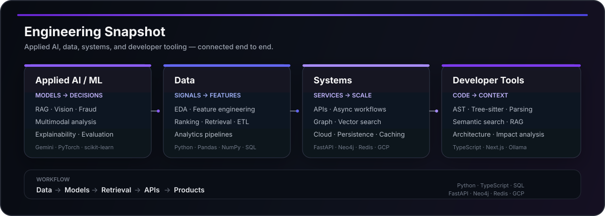

# Mahi Nigam

**Computer Science undergraduate · AI/ML · Data · Systems**

*Building software that turns data, models, and infrastructure into useful systems.*

---

## About

I'm **Mahi Nigam**, a Computer Science undergraduate building across **AI/ML, data, backend systems, and developer tooling**.

My GitHub work spans data analysis, document intelligence, fraud detection, retrieval systems, static analysis, and full-stack applications. I focus on taking an idea from a model or algorithm to a usable system with APIs, pipelines, persistence, and a real interface.

### What I work on

- **Applied AI / ML** — fraud detection, multimodal document analysis, computer vision, model-driven products
- **Data systems** — preprocessing, feature engineering, ranking, retrieval, analytics pipelines
- **AI infrastructure** — RAG, vector search, embeddings, graph-based reasoning, evaluation
- **Backend engineering** — FastAPI / Flask services, APIs, async workflows, caching, persistence
- **Developer tools** — code intelligence, repository analysis, semantic search, architectural discovery

---

## Engineering Snapshot

The common thread across these areas is a full path from **data → models → retrieval → APIs → products**.

---

## Stack

**Languages**  
    

**AI / Data**  
     

**Backend / Infra / Tools**  
     

**AI Infrastructure / Databases**  
`RAG` · `Vector Search` · `Embeddings` · `Neo4j` · `Redis` · `NetworkX` · `Gemini` · `Ollama`

---

## GitHub Activity

### Live profile overview

<picture>
  <source media="(prefers-color-scheme: dark)" srcset="https://github-readme-stats.vercel.app/api?username=mahinigam&show_icons=true&include_all_commits=true&rank_icon=github&hide_border=true&theme=github_dark" />
  
</picture>

 

### Contribution activity

<picture>
  <source media="(prefers-color-scheme: dark)" srcset="https://github-readme-activity-graph.vercel.app/graph?username=mahinigam&theme=github-compact&hide_border=true" />
  
</picture>

 

### Streak & rhythm

<picture>
  <source media="(prefers-color-scheme: dark)" srcset="https://streak-stats.demolab.com/?user=mahinigam&theme=dark&hide_border=true" />
  
</picture>

 

### Language composition

<picture>
  <source media="(prefers-color-scheme: dark)" srcset="https://github-readme-stats.vercel.app/api/top-langs/?username=mahinigam&layout=compact&langs_count=10&hide_border=true&theme=github_dark" />
  
</picture>

---

## Beyond the Repos

I also maintain work around **open-source software, technical learning, and experimentation**. The profile includes projects ranging from data analysis and AI learning resources to larger open-source codebases and developer-focused experiments.

[**Explore all repositories**](https://github.com/mahinigam?tab=repositories)

---

## Connect

 

### Building systems, not just demos.

