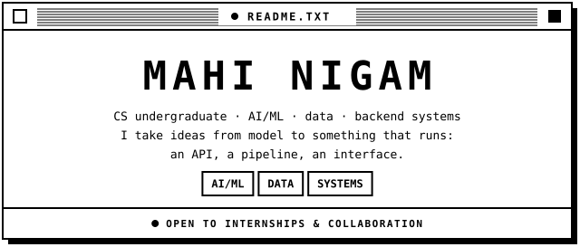
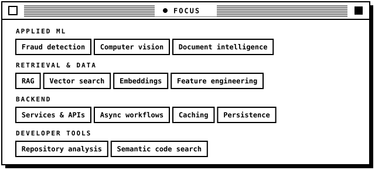
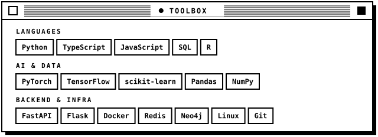
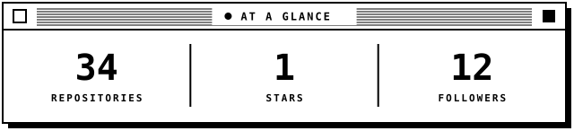
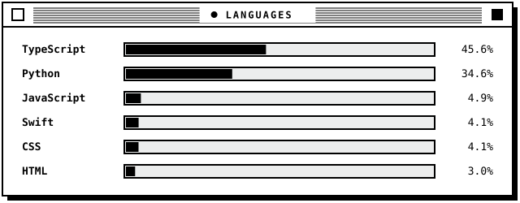
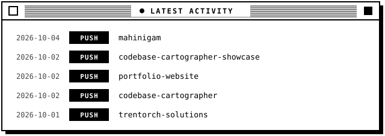

[LinkedIn](https://linkedin.com/in/mahinigam) · [X](https://twitter.com/immahinigam) · [Email](mailto:mahinigam.000@gmail.com)

Stats, languages and activity refresh automatically every 6 hours.

